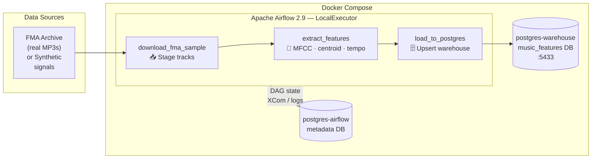

# airflow-etl-music-features

[](https://github.com/soyDCAR/airflow-etl-music-features/actions/workflows/ci.yml)
[](https://www.python.org/downloads/release/python-3110/)
[](https://airflow.apache.org/)
[](https://docs.docker.com/compose/)
[](https://www.postgresql.org/)
[](https://github.com/astral-sh/ruff)

Production-grade ETL pipeline that ingests [Free Music Archive (FMA)](https://github.com/mdeff/fma) audio samples, extracts acoustic features with **librosa**, and loads them into a **Postgres** data warehouse — all orchestrated by **Apache Airflow** inside **Docker Compose**.

---

## Pipeline Architecture



---

## Quickstart

### 1. Clone & configure

```bash
git clone https://github.com/soyDCAR/airflow-etl-music-features.git
cd airflow-etl-music-features

cp .env.example .env
# Edit .env — generate a Fernet key:
python -c "from cryptography.fernet import Fernet; print(Fernet.generate_key().decode())"
# Paste the output as FERNET_KEY in .env
```

### 2. Build & start

```bash
# First run: initialises metadata DB and creates the admin user
docker compose up airflow-init

# Then bring up the full stack
docker compose up --build -d
```

### 3. Open the UI

Navigate to [http://localhost:8080](http://localhost:8080) — credentials are `airflow / airflow` (or whatever you set in `.env`).

Enable and trigger `extract_fma_features`. By default it runs in **synthetic mode** (no downloads, instant results). To use real FMA data set the Airflow Variable `FMA_USE_SYNTHETIC` to `false`.

---

## Warehouse Schema

**Table:** `audio_features`

| Column | Type | Description |
|---|---|---|
| `id` | `BIGSERIAL` | Auto PK |
| `track_id` | `VARCHAR(20)` | FMA track ID or `SYN_XXXX` |
| `title` | `TEXT` | Track title |
| `duration_sec` | `FLOAT` | Clip duration in seconds |
| `sample_rate` | `INTEGER` | Audio sample rate (Hz) |
| `mfcc_mean` | `JSONB` | Mean of 13 MFCC coefficients |
| `mfcc_std` | `JSONB` | Std dev of 13 MFCC coefficients |
| `spectral_centroid_mean` | `FLOAT` | Mean spectral centroid (Hz) |
| `spectral_centroid_std` | `FLOAT` | Std dev spectral centroid |
| `tempo` | `FLOAT` | Estimated BPM |
| `processed_at` | `TIMESTAMPTZ` | Last pipeline run time |
| `created_at` | `TIMESTAMPTZ` | Row creation time |

Connect directly to the warehouse on `localhost:5433` (user/pass from `.env`).

---

## Development

```bash
# Lint
ruff check .
black --check .

# Tests (no Docker needed)
pip install apache-airflow==2.9.0 \
  --constraint "https://raw.githubusercontent.com/apache/airflow/constraints-2.9.0/constraints-3.11.txt"
pip install librosa soundfile psycopg2-binary pandas pytest ruff black

AIRFLOW__DATABASE__SQL_ALCHEMY_CONN=sqlite:////tmp/af.db \
AIRFLOW__CORE__LOAD_EXAMPLES=False \
airflow db migrate && pytest tests/ -v
```

---

## Project Structure

```
.
├── dags/
│   └── extract_fma_features.py   # Main pipeline DAG (TaskFlow API)
├── plugins/                       # Custom Airflow operators/hooks (future)
├── tests/
│   ├── conftest.py                # Airflow env vars for CI
│   └── test_dag_integrity.py      # Structure & dependency checks
├── sql/
│   └── init/
│       └── 01_create_tables.sql   # Warehouse DDL (auto-run on first start)
├── .github/workflows/ci.yml       # Ruff + Black + pytest on push/PR
├── docker-compose.yml
├── Dockerfile                     # Extends official Airflow image + librosa
├── pyproject.toml                 # Ruff + Black + pytest config
├── requirements.txt
└── .env.example
```

---

## What's Next (P2)

| Feature | Description |
|---|---|
| **Kafka real-time ingestion** | Stream new track events instead of batch daily runs |
| **dbt transformations** | Build `dim_tracks`, `fct_audio_features`, genre aggregates |
| **Retries & alerting** | Slack callbacks on task failure, dead-letter queue |
| **Partitioned loads** | Partition `audio_features` by `processed_at` month |
| **Streamlit dashboard** | Interactive explorer for tempo, MFCC clusters, genre search |
| **Great Expectations** | Data quality checks between extract and load |

---

> **Screenshot:** *(Add Airflow UI screenshot here after first successful run)*
