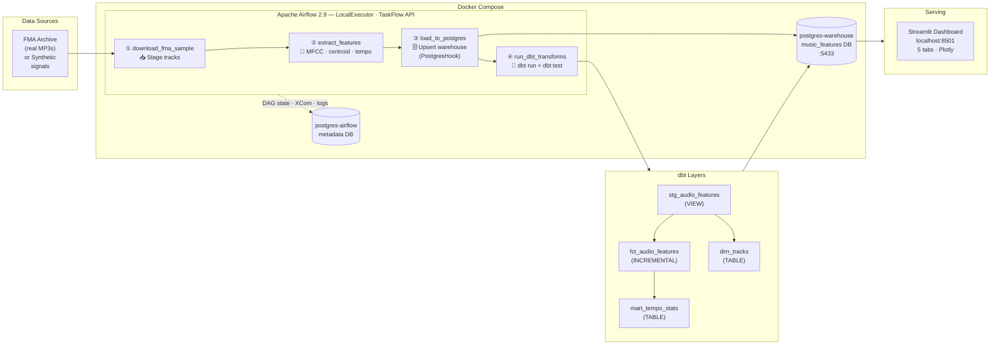

# airflow-etl-music-features

[](https://github.com/soyDCAR/airflow-etl-music-features/actions/workflows/ci.yml)
[](https://www.python.org/downloads/release/python-3110/)
[](https://airflow.apache.org/)
[](https://docs.docker.com/compose/)
[](https://www.postgresql.org/)
[](https://github.com/astral-sh/ruff)

Production-grade pipeline that ingests [Free Music Archive (FMA)](https://github.com/mdeff/fma) audio, extracts acoustic features with **librosa**, transforms them with **dbt**, and serves a live **Streamlit** dashboard — all orchestrated by **Apache Airflow** inside **Docker Compose**. Built as a reusable template for **ML training pipelines and batch inference workflows**.

---

## Pipeline Architecture



---

## Quickstart

### 1. Clone & configure

```bash
git clone https://github.com/soyDCAR/airflow-etl-music-features.git
cd airflow-etl-music-features

cp .env.example .env
# Generate a Fernet key and paste it as FERNET_KEY in .env:
python -c "from cryptography.fernet import Fernet; print(Fernet.generate_key().decode())"
```

### 2. Build & start

```bash
# First run — initialises the metadata DB and creates the admin user
docker compose up airflow-init

# Bring up the full stack (Airflow + two Postgres + Streamlit dashboard)
docker compose up --build -d
```

### 3. Open the UIs

| Service | URL | Credentials |
|---|---|---|
| Airflow | http://localhost:8080 | `airflow / airflow` |
| Streamlit dashboard | http://localhost:8501 | — |
| Warehouse (psql) | `localhost:5433` | from `.env` |

Enable and trigger `extract_fma_features`. By default it runs in **synthetic mode** (numpy sine waves, no downloads, instant results). Set the Airflow Variable `FMA_USE_SYNTHETIC` to `false` for real FMA audio.

> 


---

## Key Engineering Decisions

| Decision | Detail |
|---|---|
| **TaskFlow API** | `@dag` / `@task` decorators; XCom passes typed dicts between tasks automatically |
| **PostgresHook** | Zero credentials in code — connection read from `AIRFLOW_CONN_POSTGRES_WAREHOUSE` env var |
| **Exponential backoff** | `retry_exponential_backoff=True`, `max_retry_delay=30 min`, `on_failure_callback` for Slack |
| **dbt incremental** | `fct_audio_features` only processes rows newer than `max(processed_at)` — safe for daily runs |
| **Synthetic mode** | Numpy sine waves replace real downloads in CI/dev — same code path, zero network calls |
| **scipy pin** | `scipy==1.11.4` — librosa 0.10.x uses `scipy.signal.hann` removed in 1.12 |

---

## Warehouse Schema

**Staging → Marts (dbt)**

```
public.audio_features          ← raw upsert target (PostgresHook)
       │
       └─ marts.stg_audio_features  (VIEW  — adds tempo_bucket, duration_bucket)
              ├─ marts.fct_audio_features   (INCREMENTAL TABLE — one row per track)
              ├─ marts.dim_tracks           (TABLE — track metadata dimension)
              └─ marts.mart_tempo_stats     (TABLE — aggregated BPM stats per bucket)
```

**`public.audio_features`** — raw feature store

| Column | Type | Description |
|---|---|---|
| `track_id` | `TEXT` | FMA ID or `SYN_XXXX` |
| `mfcc_mean` | `JSONB` | Mean of 13 MFCC coefficients |
| `mfcc_std` | `JSONB` | Std dev of 13 MFCC coefficients |
| `spectral_centroid_mean` | `FLOAT` | Mean spectral centroid (Hz) |
| `tempo` | `FLOAT` | Estimated BPM (librosa beat tracker) |
| `processed_at` | `TIMESTAMPTZ` | Pipeline run timestamp |

---

## Development

```bash
# Lint + format
ruff check .
black --check .

# Run tests locally (no Docker needed)
pip install apache-airflow==2.9.0 \
  --constraint "https://raw.githubusercontent.com/apache/airflow/constraints-2.9.0/constraints-3.11.txt"
pip install librosa soundfile psycopg2-binary pandas pytest ruff==0.4.2 black==24.4.2

AIRFLOW__DATABASE__SQL_ALCHEMY_CONN=sqlite:////tmp/af.db \
AIRFLOW__CORE__LOAD_EXAMPLES=False \
airflow db migrate && pytest tests/ -v
```

Pre-commit hooks (black + ruff) run automatically on every `git commit`.

---

## Project Structure

```
.
├── dags/
│   ├── extract_fma_features.py   # 4-task DAG: download → extract → load → dbt
│   └── callbacks.py              # on_failure_callback + sla_miss_callback (Slack-ready)
├── dbt/
│   ├── models/
│   │   ├── staging/              # stg_audio_features (VIEW)
│   │   └── marts/                # fct_audio_features (INCREMENTAL), dim_tracks, mart_tempo_stats
│   ├── macros/                   # generate_schema_name (prevents public_marts bug)
│   └── profiles.yml              # reads WAREHOUSE_DB_* env vars
├── app/
│   ├── main.py                   # Streamlit 5-tab dashboard
│   ├── db.py                     # SQLAlchemy engine + cached query helpers
│   └── charts.py                 # Plotly chart builders
├── tests/
│   ├── conftest.py               # Airflow SQLite env + sys.path for dags/
│   ├── test_dag_integrity.py     # Structure, task count, dependency order
│   └── test_dag_callbacks.py     # SLA, retries, exponential backoff assertions
├── sql/
│   ├── init/                     # DDL auto-run on postgres-warehouse first start
│   └── migrations/               # 01_partition_audio_features.sql (monthly range)
├── .github/workflows/ci.yml      # Ruff + Black + pytest + dbt parse on push/PR
├── .pre-commit-config.yaml       # Local black + ruff hooks
├── docker-compose.yml            # Airflow + 2× Postgres + Streamlit
├── Dockerfile                    # Extends official Airflow image + librosa + dbt
├── Dockerfile.dashboard          # python:3.11-slim + Streamlit
├── pyproject.toml                # Ruff + Black + pytest config
└── requirements.txt
```

---

## Roadmap — Toward ML Pipelines

This repo is intentionally structured as a **reusable template for ML orchestration**. The same DAG pattern (ingest → transform → validate → serve) applies directly to training pipelines and batch inference:

| Next step | Description |
|---|---|
| **Training pipeline DAG** | Add `train_model` task after `run_dbt_transforms` — reads `mart_tempo_stats`, trains a sklearn/XGBoost genre classifier, serialises to `models/` |
| **Batch inference DAG** | Scheduled DAG that loads the latest model artifact, runs predictions over new tracks, writes results back to the warehouse |
| **Retraining trigger** | Sensor task that watches for data drift (e.g. new tempo distribution) and triggers retraining automatically |
| **Model registry** | Log metrics + artefacts to MLflow; promote champion model via Airflow Variable |
| **Data quality gate** | Great Expectations checkpoint between `load_to_postgres` and `run_dbt_transforms` — fail fast on schema drift |
